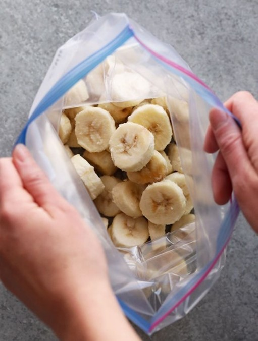
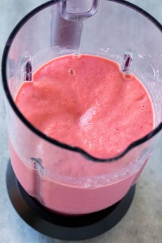

# Recipe 1: Smoothie (vegan)

This is the simplest recipe, and it is also vegan.

## Tools

- Blender
- Knife
- Cutting board
- 1 Frozen banana
- 1 cup strawberries
- 1 cup dairy free milk
- ½ cup dairy free yogurt
- Peanut butter

## Steps

**Note** Before starting you will need to freeze the banana for about 60 minutes

1. Freeze banana
   1. Cut banana into small pieces
   2. Place in freezer for about 60 minutes (Figure 8)
2. Wash and cut strawberries
3. Add frozen banana, strawberries, milk, and yogurt to blender
4. Place lid on blender
5. Blend until smooth, about 1 minute (Figure 9)
6. Pour into cups

*Figure 8: place cut bananas in bag and freeze*

*Figure 9: blended smoothie*

At the end you should have banana strawberry smoothies!

Source: [recipe](https://www.blessthismessplease.com/8-simple-smoothie-recipes/)
