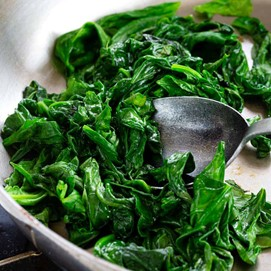

# Recipe 2: Frittata

This recipe is savory and for meat lovers.

## Tools

- Pan
- Large Skillet
- Knife
- Cutting Board
- Whisk
- Large mixing bowl
- 6 Eggs
- 5 slices of Bacon
- Cherry tomatoes
- Spinach
- 1 cup milk
- 1 cup shredded cheese
- 2 tablespoons butter, melted
- ½ teaspoon salt
- ¼ teaspoon ground black pepper

## Steps

1. Preheat oven to 350 degrees Fahrenheit
2. Lightly grease baking pan (Figure 10)
3. Cook bacon
   1. Place bacon in large skillet
   2. Cook over medium-high heat
   3. Toss frequently until brown and crisp (Figure 11)
   4. Place bacon on plate lined with paper towels to absorb grease
   5. Cut bacon into small pieces once cooled
4. Cook spinach
   1. Return skillet to heat
   2. Add spinach and sauté for a few seconds (Figure 12)
5. Whisk eggs, milk, butter, salt, and pepper in a large mixing bowl
6. Chop cherry tomatoes in half
7. Add bacon, spinach, tomatoes, and cheese
8. Pour mixture into baking pan
9. Bake for about 30 minutes or until knife comes out clean

*Figure 10: grease pan with butter*

*Figure 11: cook bacon until crispy*

*Figure 12: sauté spinach*

At the end you should have a yummy, savory breakfast!

Source: [recipe](https://www.cookingclassy.com/frittata/ )
